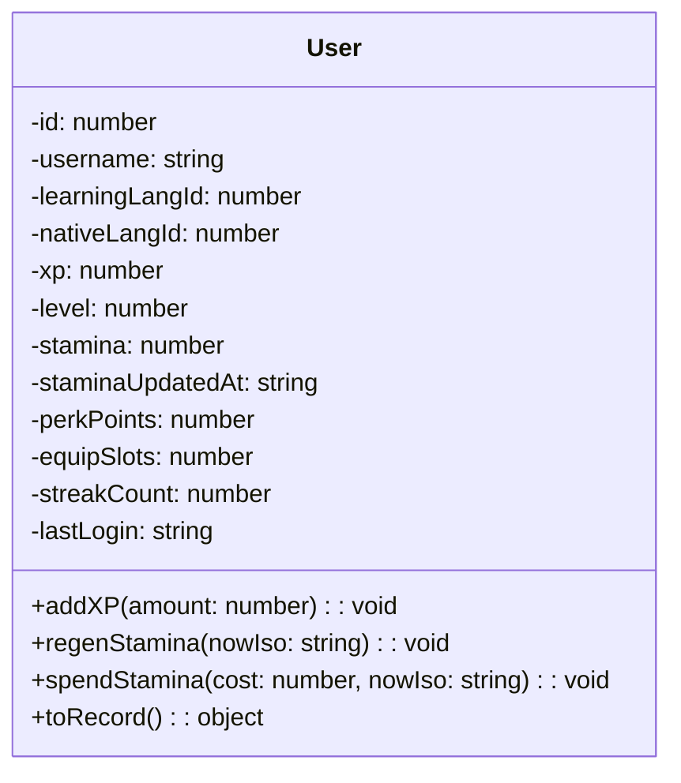
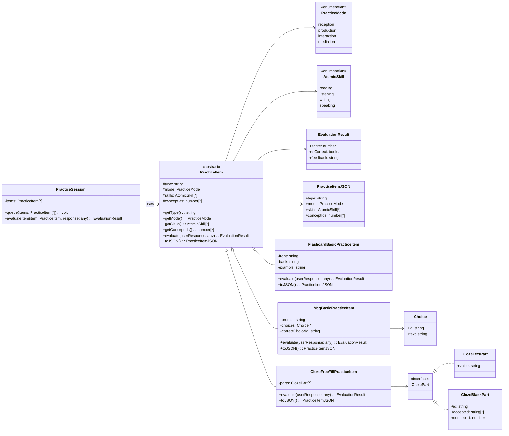

```mermaid
classDiagram

class User {
  -id: number
  -username: string
  -learningLangId: number
  -nativeLangId: number
  -xp: number
  -level: number
  -stamina: number
  -staminaUpdatedAt: string
  -perkPoints: number
  -equipSlots: number
  -streakCount: number
  -lastLogin: string

  +addXP(amount: number): void
  +regenStamina(nowIso: string): void
  +spendStamina(cost: number, nowIso: string): void
  +toRecord(): object
}
```

```mermaid
classDiagram
direction LR


class PracticeItem {
  <<abstract>>
  #type: string
  #mode: PracticeMode
  #skills: AtomicSkill[*]
  #conceptIds: number[*]

  +getType(): string
  +getMode(): PracticeMode
  +getSkills(): AtomicSkill[*]
  +getConceptIds(): number[*]

  +evaluate(userResponse: any): EvaluationResult
  +toJSON(): PracticeItemJSON
}

class PracticeSession {
  -items: PracticeItem[*]
  +queue(items: PracticeItem[*]): void
  +evaluateItem(item: PracticeItem, response: any): EvaluationResult
}

PracticeSession --> PracticeItem : uses

class PracticeMode {
  <<enumeration>>
  reception
  production
  interaction
  mediation
}

class AtomicSkill {
  <<enumeration>>
  reading
  listening
  writing
  speaking
}

class EvaluationResult {
  +score: number
  +isCorrect: boolean
  +feedback: string
}

class PracticeItemJSON {
  +type: string
  +mode: PracticeMode
  +skills: AtomicSkill[*]
  +conceptIds: number[*]
}

PracticeItem --> PracticeMode
PracticeItem --> AtomicSkill
PracticeItem --> EvaluationResult
PracticeItem --> PracticeItemJSON

class FlashcardBasicPracticeItem {
  -front: string
  -back: string
  -example: string
  +evaluate(userResponse: any): EvaluationResult
  +toJSON(): PracticeItemJSON
}

class McqBasicPracticeItem {
  -prompt: string
  -choices: Choice[*]
  -correctChoiceId: string
  +evaluate(userResponse: any): EvaluationResult
  +toJSON(): PracticeItemJSON
}

class Choice {
  +id: string
  +text: string
}

class ClozeFreeFillPracticeItem {
  -parts: ClozePart[*]
  +evaluate(userResponse: any): EvaluationResult
  +toJSON(): PracticeItemJSON
}

class ClozePart {
  <<interface>>
}

class ClozeTextPart {
  +value: string
}

class ClozeBlankPart {
  +id: string
  +accepted: string[*]
  +conceptId: number
}

PracticeItem <|-- FlashcardBasicPracticeItem
PracticeItem <|-- McqBasicPracticeItem
PracticeItem <|-- ClozeFreeFillPracticeItem

McqBasicPracticeItem --> Choice
ClozeFreeFillPracticeItem --> ClozePart
ClozePart <|.. ClozeTextPart
ClozePart <|.. ClozeBlankPart
```