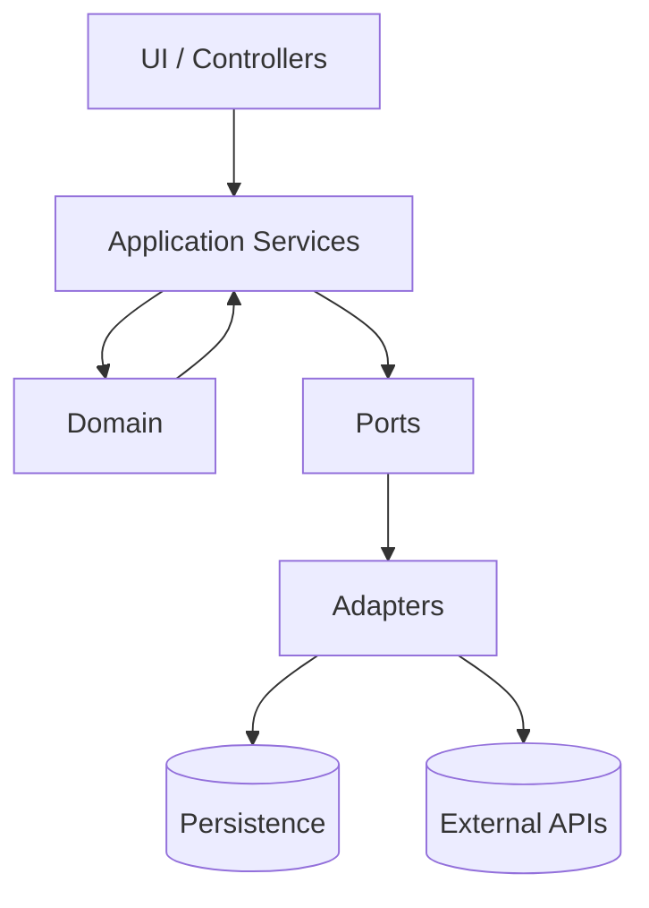

# Design: Architecture & OOP Overview

## Architecture

### High-level overview
- **UI/Interface layer**: triggers practice flows and renders results.
- **Application layer**: coordinates a practice session (start session, record turns, request next item).
- **Domain layer**: core learning/practice concepts (PracticeItem types, scoring/evaluation rules).
- **Ports (interfaces)**: repositories and external dependencies modeled as interfaces.
- **Adapters (implementations)**: DB/network implementations of ports.

### Architecture diagram

### OOP Design
Class diagram
````mermaid
classDiagram
  class PracticeItem {
    +id: string
    +mode: PracticeMode
    +skill: Skill
    +prompt: string
    +validate(): ValidationResult
    +evaluate(response): EvaluationResult
  }

  class PracticeItemRepository {
    <<interface>>
    +getById(id): PracticeItem
    +search(filters): PracticeItem[]
    +save(item): void
  }

  class PracticeSession {
    +id: string
    +turns: PracticeTurn[]
    +addTurn(turn): void
  }

  class PracticeTurn {
    +itemId: string
    +response: string
    +evaluation: EvaluationResult
  }

  PracticeSession "1" o-- "*" PracticeTurn
  PracticeTurn "*" --> "1" PracticeItem

  PracticeItem <|-- MultipleChoiceItem
  PracticeItem <|-- ClozeItem
  PracticeItem <|-- FreeResponseItem

  PracticeItemRepository ..> PracticeItem

```

## Encapsulation
- Domain objects enforce invariants (e.g., a PracticeItem cannot be created without required fields; evaluation results must include required scoring fields).
- State mutation is controlled through methods (e.g., `PracticeSession.addTurn()`), preventing invalid session states.
- Side effects (DB/API access) are encapsulated behind ports (interfaces), keeping odmain logic pure and testable. 

## Polymorphism
- `PracticeItem.evaluate(response)` is polymorphic:
    - Multiple choice items evaluate via options matching and feedback mapping. 
    - Cloze items evaluate via token/blank correctness.
    - Free response items evaluate via rubric/LLM scoring (if applicable)
- `PracticeItem.validate()` can be overridden/extended per subtype to enforce type-specific rules. 