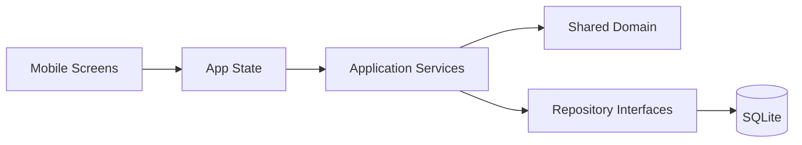
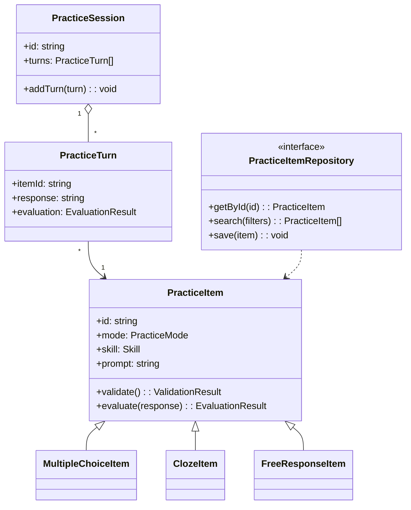

# Design: Architecture & OOP Overview

## Architecture

### High-level overview
- **UI/Interface layer**: triggers practice flows and renders results.
- **Application layer**: coordinates a practice session (start session, record turns, request next item).
- **Domain layer**: core learning/practice concepts (PracticeItem types, scoring/evaluation rules).
- **Ports (interfaces)**: repositories and external dependencies modeled as interfaces.
- **Adapters (implementations)**: DB/network implementations of ports.

### Architecture diagram

## Frontend Architecture (Mobile Client)

The mobile client is implemented using Expo (React Native) and follows a local-first architecture. The application is structured to keep UI, state management, domain logic, and data access concerns clearly separated.

### Key frontend layers
- **Screens (Expo Router)**  
  Responsible for navigation and rendering UI. Screens do not directly access persistence or domain logic.

- **App State (UI Runtime State)**  
  Manages client-side runtime state such as:
  - Active language selection
  - Current practice session progress
  - Navigation flow decisions  
  This state is UI-specific and distinct from domain models.

- **Services (Application Logic)**  
  Orchestrate learning flows (e.g., starting a session, advancing practice) by coordinating domain logic and repositories.

- **Domain (Shared)**  
  Core learning models (PracticeItem hierarchy, evaluation logic, session concepts) shared across platforms.

- **Repositories (Local Persistence)**  
  SQLite-backed repositories implementing domain-defined ports. All data access is asynchronous and offline-capable.

The frontend is designed so that screens depend only on state and services, not directly on repositories or domain internals.

## Data Access Workflow (Local-First, API-Optional)

Although the system was originally designed to support a remote API, the current implementation uses a local-first architecture. All learning functionality operates entirely offline using local persistence.

### Current workflow (local-first)

## OOP Design
Class diagram

## Encapsulation
- Domain objects enforce invariants (e.g., a PracticeItem cannot be created without required fields; evaluation results must include required scoring fields).
- State mutation is controlled through methods (e.g., `PracticeSession.addTurn()`), preventing invalid session states.
- Side effects (DB/API access) are encapsulated behind ports (interfaces), keeping odmain logic pure and testable. 

## Polymorphism
- `PracticeItem.evaluate(response)` is polymorphic:
    - Multiple choice items evaluate via options matching and feedback mapping. 
    - Cloze items evaluate via token/blank correctness.
    - Free response items evaluate via rubric/LLM scoring (if applicable)
- `PracticeItem.validate()` can be overridden/extended per subtype to enforce type-specific rules. 