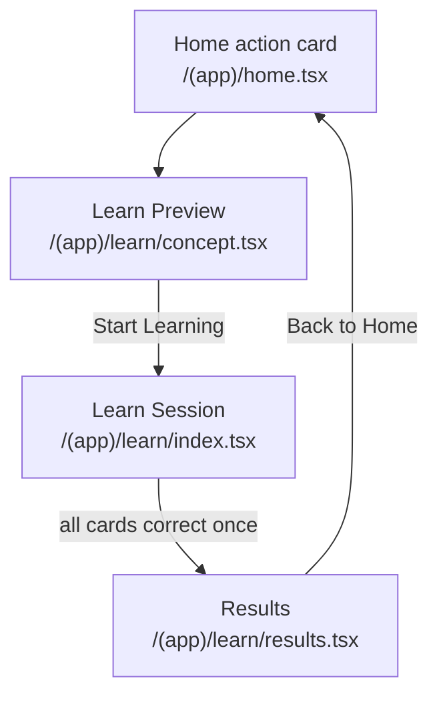
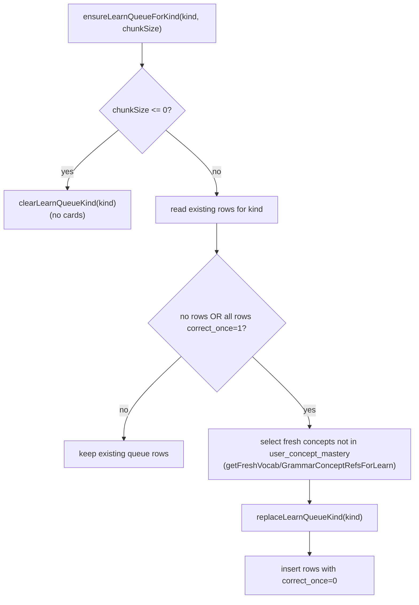
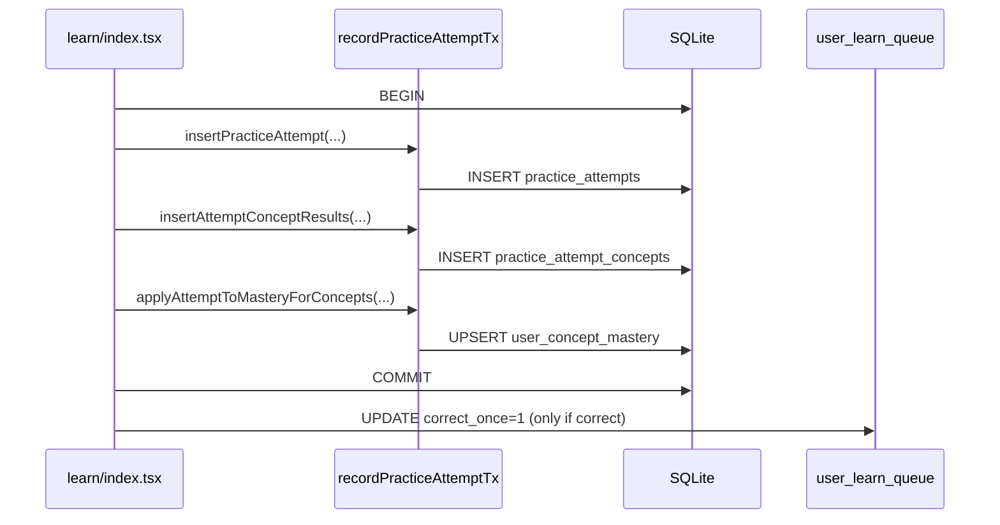

# Learn Service Flow

This document explains how Learn works end-to-end in Hermes, with emphasis on:

- which files own which behavior
- how queue rows are created and consumed
- what gets written to analytics/mastery tables

## High-level Flow

## File Map

Core Learn route files:

- `hermes/src/app/(app)/learn/concept.tsx`
- `hermes/src/app/(app)/learn/index.tsx`
- `hermes/src/app/(app)/learn/results.tsx`

Primary Learn data/query files:

- `hermes/src/db/queries/learn.ts`
- `hermes/src/db/queries/concepts.ts`
- `hermes/src/db/queries/practice.ts`
- `hermes/src/db/queries/sessions.ts`
- `hermes/src/analytics/finalize.ts`
- `hermes/shared/schema.ts`

Supporting state and entry points:

- `hermes/src/app/(app)/home.tsx`
- `hermes/src/app/(modals)/learn-settings.tsx`
- `hermes/src/components/ui/LearnSettingsEditor.tsx`
- `hermes/src/state/AppState.tsx`
- `hermes/src/app/(app)/_layout.tsx`

## What Each Learn Screen Does

### `concept.tsx` (preview + queue warm-up)

- Loads user learn settings via `getLearnSettings`.
- Ensures queue exists for both kinds via `ensureLearnQueueForKind`:
  - `vocab_item` using `vocabChunkSize`
  - `grammar_point` using `grammarChunkSize`
- Reads queue rows with `listLearnQueueRows`.
- Filters pending rows (`correctOnce === 0`), resolves concept metadata via `getConceptRefsByConceptIds`, and renders preview lists.
- "Start Learning" navigates to `/(app)/learn` with a `run` param to force a fresh load.

### `index.tsx` (actual learn session)

- Starts a DB session (`practice_sessions`) via `startPracticeSession` with `source: "learn"`.
- Stores session ID in app state (`sessionDbId`) and local state.
- Re-ensures queue for vocab + grammar.
- Builds flashcards from pending queue rows:
  - vocab rows create reception and production cards
  - grammar rows create reception cards
- On submit:
  - writes attempt + per-concept evidence + mastery update in one transaction via `recordPracticeAttemptTx`
  - if correct, marks corresponding queue row complete via `markLearnQueueCorrect`
  - if incorrect, requeues card to end of in-memory card list
- When all cards in the current run are completed, navigates to `/learn/results`.

### `results.tsx` (session close + summary)

- On focus, finalizes session once via `finalizePracticeSession` -> `completePracticeSession` (`completed_at`).
- Reads aggregate stats from `practice_attempts` and `practice_attempt_concepts`.
- Displays percent correct, fluency label, attempts, and back-to-home CTA.

## Queue Lifecycle

Key details:

- Queue table is `user_learn_queue`.
- Queue primary key is `(user_id, language_id, concept_id, modality)`.
- Vocab adds two rows per concept: `reception` and `production`.
- Grammar adds one row per concept: `reception`.
- Queue is replaced per kind only when empty or fully completed.

## Data Write Path Per Answer

## Relevant Tables

Learn configuration and queue:

- `user_learn_settings`
- `user_learn_queue`

Session/attempt analytics:

- `practice_sessions`
- `practice_attempts`
- `practice_attempt_concepts`

Long-term spaced repetition state:

- `user_concept_mastery`

Content references:

- `concepts` (points to vocab/grammar entities)
- `vocab_items` + `vocab_tags` + `vocab_item_tags`
- `grammar_points` + `grammar_tags` + `grammar_point_tags`

## Selection Logic for "Fresh" Learn Concepts

Both selectors prioritize lower CEFR first (`A1 -> C2`) and randomize within level:

- `getFreshVocabConceptRefsForLearn` in `concepts.ts`
- `getFreshGrammarConceptRefsForLearn` in `concepts.ts`

Both exclude concepts already present in `user_concept_mastery` for the same user/model.

## Learn Stats on Home

`home.tsx` computes Learn card progress from two sources:

- Daily completion counts from attempt history (`getLearnCompletedTodayByKind`).
- Daily targets from settings (`getLearnSettings`).

The Learn queue itself is controlled by chunk sizes, not daily targets.

## Routing Notes

Registered in app drawer layout:

- `learn/concept`
- `learn/index`
- `learn/results`

The Learn run uses:

- Preview entry: `/(app)/learn/concept`
- Session entry: `/(app)/learn`
- Results transition: `/learn/results`

These are valid in Expo Router due to route-group-aware path resolution.

## Practical Debug Checklist

If Learn shows no cards:

- Confirm active profile/language in `AppState`.
- Check `user_learn_settings` chunk sizes are > 0.
- Check queue rows exist in `user_learn_queue`.
- Check `concepts` has `title` and `description` populated for selected concepts.
- Check "fresh selector" exclusion from `user_concept_mastery` is not filtering everything.

If cards appear but progress does not move:

- Verify `recordPracticeAttemptTx` commits.
- Verify `markLearnQueueCorrect` updates row with matching `(concept_id, modality)`.
- Verify `sessionDbId` exists before submit.
